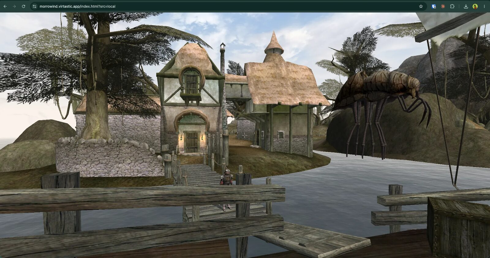

# openmw-web

**Play Morrowind in your browser.** The OpenMW engine, compiled to WebAssembly, by [Virtastic](https://virtastic.app).

<p align="center">
  <a href="https://morrowind.virtastic.app"></a>
</p>

<p>
  <a href="https://morrowind.virtastic.app"><b>▶ Play now at morrowind.virtastic.app</b></a> ·
  <a href="https://discord.gg/PzFfDkbSue">Discord</a> ·
  <a href="https://www.youtube.com/@Virtastic-Apps">YouTube</a> ·
  <a href="https://github.com/Virtastic/openmw-web/releases">Releases</a> ·
  <a href="https://github.com/Virtastic/openmw-web/issues">Issues</a> ·
  <a href="https://github.com/Virtastic/openmw-web/discussions">Discussions</a>
</p>

[](https://discord.gg/PzFfDkbSue)


[](https://github.com/Virtastic/openmw-web/releases)

openmw-web is a WebAssembly build of [OpenMW](https://openmw.org/), the open-source
reimplementation of *The Elder Scrolls III: Morrowind*. The whole engine runs client-side in
a desktop browser - no plugins, no streaming service, and no game data included: you bring
your own legally-owned copy.

**New in 1.2.0: the admin dashboard.** Run your own server entirely from a browser - a setup
wizard, a mod manager with drag-to-order, Tamriel Rebuilt support, savegame export, backups,
logs and accounts. Multiplayer (added in 1.1.0) is there too, behind an experimental flag.

## Quick start: your own server

You need [Docker](https://docs.docker.com/get-started/get-docker/) and your own copy of
Morrowind. Then:

```bash
git clone https://github.com/Virtastic/openmw-web.git
cd openmw-web
./setup.sh        # Windows: .\setup.ps1
```

1. Grab the latest `openmw-web-*.zip` from
   [Releases](https://github.com/Virtastic/openmw-web/releases) and unzip it into `play/`
   (the game engine is too big for git - the script reminds you).
2. Your browser opens **http://localhost/admin**. Create your admin account, answer the
   wizard.
3. Drag your Morrowind `Data Files` folder in when it asks. Play at **http://localhost**.

That's it. [`SELF_HOSTING.md`](SELF_HOSTING.md) covers everything else - the dashboard page
by page, mods, Tamriel Rebuilt, multiplayer, domains and HTTPS. Stuck? Ask in
[Discord](https://discord.gg/PzFfDkbSue).

## Playing

On your own server, open **http://localhost** in desktop Chrome - or just play the hosted
site at [morrowind.virtastic.app](https://morrowind.virtastic.app). The launcher offers:

- **The example world** - a small free demo, no Morrowind required.
- **Bring your own Morrowind** - point the browser at your `Data Files` folder; files stream
  from disk on demand, nothing is uploaded.
- **This server's copy** - when the host has game data staged, play it with nothing to pick.
- **Your own Morrowind, from anywhere** - sign in and upload once; it follows your account
  to any machine, saves included.

Settings and keybindings persist in the browser. Saves go with how you play: to real files
inside your picked folder ("bring your own"), to the server when signed in, or to browser
storage for the offline demo. In-game, **Options → Video** has a resolution-scale setting -
drop it a notch on lighter hardware.

### Troubleshooting

- **"Can't open this folder because it contains system files."** Chromium refuses folders
  under `Program Files`, where Steam's default library lives. Copy `Data Files` to your
  Desktop or Documents and pick it there. GOG installs are unaffected.
- **"Doesn't look like a Data Files folder."** Pick the folder actually containing
  `Morrowind.esm` and `Morrowind.bsa` (or its parent `Morrowind` folder).
- **No sound, music, or intro video.** Your copy is missing the loose `Sound`/`Music`/`Video`
  folders that live beside the archives. A normal Steam or GOG install has them.

More help: [Discord](https://discord.gg/PzFfDkbSue).

## Multiplayer

**Experimental.** Playable, but young - expect rough edges.

Three ways to play, switched from inside the game: **Solo** (your own world), **Party**
(your group in one world), and **Public** (a shared lobby with strangers - nothing there is
permanent; you leave with exactly what you brought). Visiting a friend's world advances
*their* campaign; you keep the skills you used and what you carry out.

The server owns the world: NPCs, combat resolution and loot are simulated server-side by a
headless copy of the engine, so a modified client cannot author what an NPC did. Friends,
parties with loot rolls, whisper/mute/block, in-game reporting and server-side saves are all
there.

On the hosted service, sign-in is SSO only (Google / Discord / Microsoft - no passwords to
leak; accounts are keyed on the provider's stable ID, never your email). A server you run
chooses its own sign-in in the setup
wizard. Running your own is the [quick start](#quick-start-your-own-server) above with
`OMW_EXPERIMENTAL=multiplayer` set; provider-side steps live in
[`docs/MULTIPLAYER-SETUP.md`](docs/MULTIPLAYER-SETUP.md).

## What's in this repo

A code-only repo - game assets, dependency caches and build outputs are gitignored.

| Path | Purpose |
|------|---------|
| `openmw/` | OpenMW engine source (upstream plus local WASM changes) |
| `play/` | Browser front-end: launcher, game page, dev server |
| `server/` | The server (TypeScript/Node): admin dashboard, worlds, SSO, storage, savegames |
| `wasm-build/` | Build scripts, patches and tooling for the WASM engine |
| `deploy/` | Container and reverse-proxy config |

The `openmw/` tree tracks upstream at the commit recorded in
[`.openmw-base-commit.txt`](.openmw-base-commit.txt); how the desktop engine was made to run
in a browser tab is written up in [`WASM_ADAPTATIONS.md`](WASM_ADAPTATIONS.md).

## Releases

Every [release](https://github.com/Virtastic/openmw-web/releases) ships two archives:

- **`openmw-web-<tag>.zip`** - the prebuilt engine and web front-end. It feeds the Docker
  quick start (unzip into `play/`) and also runs standalone: unzip anywhere and double-click
  `Start openmw-web` for a dashboard-less static server.
- **`openmw-web-src-<tag>.tar.gz`** - the exact source snapshot (GPLv3 Corresponding
  Source).

See [`CHANGELOG.md`](CHANGELOG.md) for what changed.

## Building from source

Only needed if you are changing the engine itself - the releases ship it prebuilt. The
toolchain (Emscripten 6.0.1), the dependency stack, the wasm64 story and every hard-won
gotcha live in [`docs/BUILDING.md`](docs/BUILDING.md). Questions:
[Discord](https://discord.gg/PzFfDkbSue).

### Browser requirement

Desktop Chrome or Chromium with MEMORY64 (Chrome/Edge 133+): the engine needs
SharedArrayBuffer + threads, WebGL2 via ANGLE, `EXT_clip_control`, and the File System
Access API. Firefox, Safari and mobile are not supported.

## License

openmw-web is licensed under the GNU General Public License, version 3. It is a derivative
work of OpenMW, which is itself GPLv3, so the combined work is GPLv3. The full text is in
[`LICENSE`](LICENSE); bundled dependencies keep their own licenses (see
[`THIRD-PARTY-LICENSES.md`](THIRD-PARTY-LICENSES.md)).

### Game data and trademarks

*The Elder Scrolls* and *Morrowind* are trademarks of ZeniMax Media / Bethesda Softworks.
This project is not affiliated with, endorsed by, or associated with Bethesda or ZeniMax. No
Morrowind game data is included or distributed here; you must own and supply your own
legally-obtained copy. The engine is an independent, clean-room reimplementation (OpenMW)
and ships no Bethesda assets.

## Community

- **[Discord](https://discord.gg/PzFfDkbSue)** - the fastest place for help, screenshots,
  and news. Technical deep-dives welcome.
- **[YouTube (@Virtastic-Apps)](https://www.youtube.com/@Virtastic-Apps)** - demos, build
  logs, and other native-to-browser ports.
- **[GitHub Discussions](https://github.com/Virtastic/openmw-web/discussions)** - longer
  questions and showcases.

Bugs and features go to [Issues](https://github.com/Virtastic/openmw-web/issues); pull
requests are welcome, see [`CONTRIBUTING.md`](CONTRIBUTING.md).

## Support the project

openmw-web is built and hosted by [Virtastic](https://virtastic.app). If you enjoy it, you
can support us on [Ko-fi](https://ko-fi.com/virtastic) or
[Patreon](https://patreon.com/virtastic) - it pays for the servers and the development time.
Nothing is behind a paywall: every mode is free to everyone, and no tier buys a feature.

## Credits

- WASM port, tooling, and hosting: © 2025–2026 [Virtastic](https://virtastic.app). See
  [`NOTICE`](NOTICE) and [`AUTHORS.md`](AUTHORS.md).
- OpenMW: the engine this is built on, by the [OpenMW team](https://openmw.org/).
- Demo world: the OpenMW Example Suite (CC-BY / CC-BY-SA) by DestinedToDie and contributors,
  plus the OpenMW template data files.
